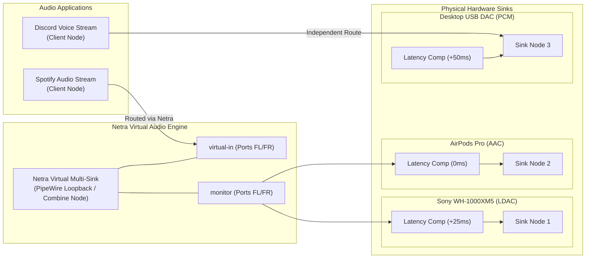
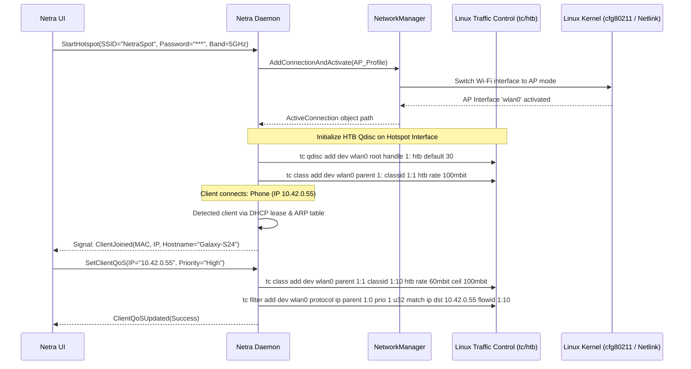
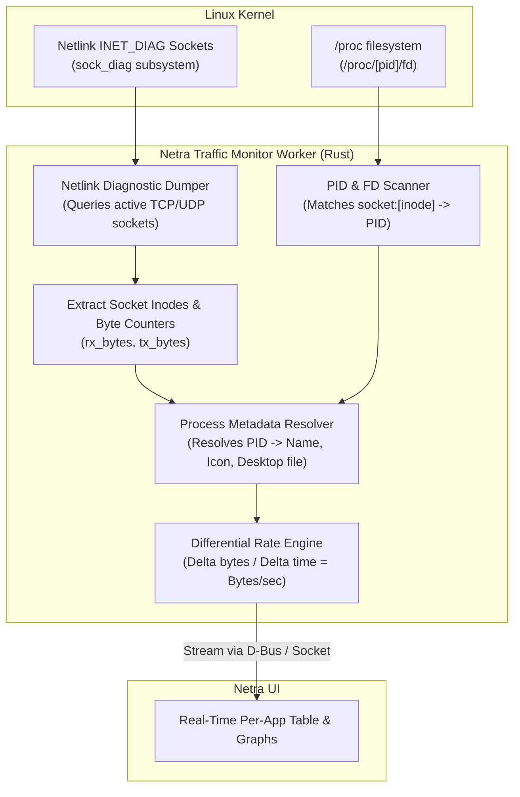

# Netra — Systems Architecture Specification

> **Document Version:** 1.0.0  
> **Status:** Architecture Baseline  
> **Audience:** Core Systems Engineers, Linux Developers  

---

## 1. Architectural Philosophy

Netra is designed around three foundational principles:
1. **Strict Privilege Separation:** The graphical user interface runs entirely unprivileged in the user session. All operations requiring elevated kernel capabilities (`CAP_NET_ADMIN`, `CAP_NET_RAW`) are mediated by a dedicated system daemon (`netra-daemon`) guarded by Polkit authorization.
2. **Native Linux Subsystem Integration:** Rather than reinventing low-level drivers, Netra leverages modern, de facto standard Linux infrastructure: NetworkManager (via D-Bus), BlueZ 5.x (via D-Bus), PipeWire / WirePlumber (via native C API / `pipewire-rs`), and Linux Traffic Control (`tc` / Netlink).
3. **Event-Driven & Microsecond-Reactive:** Polling is minimized. State updates flow reactively via D-Bus PropertiesChanged signals, Netlink multicast sockets, and PipeWire graph change events.

---

## 2. Layered Architecture

```
┌────────────────────────────────────────────────────────────────────────┐
│                        PRESENTATION LAYER                              │
│                    Netra Desktop UI (Flutter)                          │
│  ┌───────────────────────┬──────────────────────┬───────────────────┐  │
│  │ Network Dashboard     │ Smart Hotspot & QoS  │ Bluetooth Center  │  │
│  ├───────────────────────┴──────────────────────┴───────────────────┤  │
│  │ Audio Routing Matrix & Multi-Bluetooth Sink Controller           │  │
│  ├──────────────────────────────────────────────────────────────────┤  │
│  │ State Management: Riverpod / AsyncNotifier Event Stream Providers │  │
│  └──────────────────────────────────┬───────────────────────────────┘  │
└─────────────────────────────────────┼──────────────────────────────────┘
                                      │ IPC Layer
                                      ▼
┌────────────────────────────────────────────────────────────────────────┐
│                        IPC & PROTOCOL LAYER                            │
│  ┌──────────────────────────────────┬───────────────────────────────┐  │
│  │ System D-Bus: org.netra.Control  │ Unix Domain Socket Stream     │  │
│  │ (Methods, Signals, Properties)   │ (/run/netra/telemetry.sock)   │  │
│  └──────────────────────────────────┴───────────────────────────────┘  │
└─────────────────────────────────────┼──────────────────────────────────┘
                                      │ Polkit Auth Verification
                                      ▼
┌────────────────────────────────────────────────────────────────────────┐
│                        SYSTEM DAEMON (netrad)                          │
│                      Rust Async Runtime (Tokio)                        │
│  ┌──────────────────────┬───────────────────────┬───────────────────┐  │
│  │ Network Controller   │ Hotspot & QoS Engine  │ BT Orchestrator   │  │
│  │ (zbus -> NM D-Bus)   │ (tc, htb, dnsmasq)    │ (zbus -> BlueZ)   │  │
│  ├──────────────────────┴───────────────────────┴───────────────────┤  │
│  │ PipeWire Native Audio Engine (pipewire-rs / libpipewire-0.3)     │  │
│  ├──────────────────────────────────────────────────────────────────┤  │
│  │ Traffic & Socket Monitor (Netlink sock_diag + /proc inode map)   │  │
│  └──────────────────────────────────┬───────────────────────────────┘  │
└─────────────────────────────────────┼──────────────────────────────────┘
                                      │ Native Linux Subsystem Calls
                                      ▼
┌────────────────────────────────────────────────────────────────────────┐
│                    LINUX PLATFORM & KERNEL SUBSYSTEMS                  │
│  ┌─────────────────┬──────────────────┬─────────────────────────────┐  │
│  │ NetworkManager  │ BlueZ 5.x Daemon │ PipeWire + WirePlumber      │  │
│  ├─────────────────┼──────────────────┼─────────────────────────────┤  │
│  │ Linux Netlink   │ Linux TC (htb)   │ Linux Kernel Network Sockets│  │
│  │ (rtnetlink)     │ & nftables       │ & Wireless Stack (cfg80211) │  │
│  └─────────────────┴──────────────────┴─────────────────────────────┘  │
└────────────────────────────────────────────────────────────────────────┘
```

---

## 3. Subsystem Deep Dive

### 3.1. PipeWire Audio Routing & Multi-Bluetooth Engine

Traditional Linux audio tools route audio streams statically to a single sink. Netra introduces dynamic graph orchestration to achieve **Multi-Bluetooth Audio** (broadcasting one audio stream to multiple Bluetooth headphones or speakers simultaneously) with sample-level clock synchronization and latency offset compensation.

#### PipeWire Graph Mechanics
In PipeWire, every audio endpoint and application stream is modeled as a **Node** with input/output **Ports**. Links connect output ports to input ports.



#### Multi-Sink Synchronization Workflow:
1. **Creation:** When the user enables "Multi-Device Audio" for Device A and Device B, Netra requests PipeWire to construct a virtual combine-sink node.
2. **Port Linking:** PipeWire link objects (`pw_link`) are constructed from the virtual node's monitor output ports to the playback input ports of each selected physical sink.
3. **Latency Compensation:** Because different Bluetooth codecs (e.g., LDAC vs. AAC) and audio hardware have disparate transmission latencies, Netra exposes an independent millisecond offset slider for each connected sink. This injects a configurable buffer delay in the software filter chain, eliminating phase echo.
4. **Volume Decoupling:** Master volume controls the virtual combine-sink. Per-device sliders directly manipulate the physical sink nodes' hardware volume properties via PipeWire SPA props (`volume`, `mute`).

---

### 3.2. Smart Hotspot & QoS Architecture

The Hotspot engine automates Wi-Fi Access Point deployment while offering granular client bandwidth management.



#### Client Discovery Pipeline:
1. **DHCP Lease Tracking:** Netra monitors `/var/lib/NetworkManager/dnsmasq-*.leases` via `inotify`.
2. **Neighbor Cache Verification:** Queries the kernel ARP/neighbor table (`RTM_GETNEIGH` via rtnetlink) to verify active reachability (NUD states: `NUD_REACHABLE`, `NUD_STALE`).
3. **OUI Identification:** Maps the first 3 octets of client MAC addresses against an embedded IEEE OUI database to display friendly device hardware icons (Apple, Samsung, Google, Intel).

#### QoS Hierarchy (Hierarchical Token Bucket):
- **Root Class (1:1):** Total physical interface bandwidth limit.
- **High Priority Class (1:10):** Guaranteed 60% bandwidth, lowest queue latency (`fq_codel` leaf qdisc).
- **Medium Priority Class (1:20):** Guaranteed 30% bandwidth (`fq_codel` leaf qdisc).
- **Low Priority Class (1:30):** Guaranteed 10% bandwidth, rate capped (`bfifo` leaf qdisc).

---

### 3.3. Per-App Bandwidth & Process Tracking Engine

Netra calculates upload and download speeds for individual applications running on the system without requiring heavy kernel packet sniffing.



1. **Socket Enumeration:** The daemon opens a Netlink socket of family `NETLINK_INET_DIAG` and issues a dump request for `INET_DIAG_REQ_BYTECODE`.
2. **Inode Mapping:** The kernel returns all open TCP/UDP sockets with their local/remote IP endpoints, socket state, and socket inode number.
3. **Process Resolution:** The daemon caches mappings between open file descriptor socket inodes (`/proc/[pid]/fd/`) and process PIDs.
4. **Rate Derivation:** A sliding window maintains the previous second's byte counters per PID, producing an exact instantaneous upload (TX) and download (RX) rate in bytes/second.

---

### 3.4. Bluetooth & BLE Subsystem

- Uses `zbus` to communicate directly with BlueZ's ObjectManager (`org.bluez`).
- Implements discovery agent, pairing agent, and battery state listener.
- Detects connected BLE GATT devices, reading GATT characteristics for battery levels, device manufacturer, and model IDs.

---

## 4. Telemetry & Streaming Strategy

To provide buttery-smooth 60 FPS charts in the Flutter UI without choking the D-Bus system bus with high-frequency messages:
1. **High-Frequency Metrics (Bandwidth charts, audio meters):**
   - Transmitted via a lightweight Unix Domain Socket (`/run/netra/telemetry.sock`) using binary Protocol Buffers or compact MessagePack encoding.
2. **State & Control Operations (Connection changes, device list, settings):**
   - Transmitted via standard System D-Bus (`org.netra.Control`) methods, properties, and signals.
