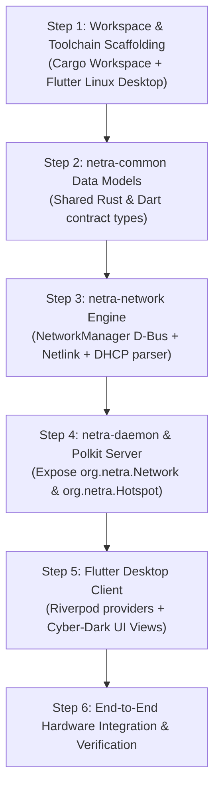

# Netra — Phase 1 (MVP) Implementation Plan & Engineering Guide

> **Document Version:** 1.0.0  
> **Target Release:** Netra v0.1.0-alpha (MVP)  
> **Status:** Implementation Blueprint  
> **Focus:** Wi-Fi Dashboard, Smart Hotspot, Connected Device Discovery & Bandwidth Telemetry  

---

## 1. MVP Objective & Scope

The purpose of Phase 1 is to build a complete, end-to-end, functional slice of Netra:
An unprivileged **Flutter Desktop UI** communicating over **System D-Bus** with a **Rust Daemon (`netra-daemon`)** to manage Wi-Fi and Hotspots without touching the terminal.

```
┌──────────────────────────────────────────────────────────────────┐
│                   PHASE 1 (MVP) DELIVERABLES                     │
├─────────────────────────────────┬────────────────────────────────┤
│ 🌐 Wi-Fi & Network Dashboard    │ 🔥 Smart Hotspot Manager       │
│ • Live AP Scan & RSSI Meters    │ • One-Click AP Mode Activation │
│ • Connect / Disconnect Dialogs  │ • 2.4 GHz vs 5 GHz Band Select │
│ • Real-time Interface RX/TX bps │ • Connected Client Discovery   │
│ • IP/Gateway/DNS Diagnostics    │ • Per-Client Data & Bandwidth  │
└─────────────────────────────────┴────────────────────────────────┘
```

---

## 2. Acceptance Criteria (Definition of Done)

| Feature | Acceptance Criteria |
|---|---|
| **Wi-Fi Scanning** | Clicking "Scan" or auto-refresh lists all available Wi-Fi networks within 1.5 seconds, displaying SSID, RSSI signal bar, frequency (2.4/5/6 GHz), and security type (WPA2/WPA3/Open). |
| **Wi-Fi Connection** | User can click an SSID, input a passphrase in a modal, and successfully authenticate. Connection status transitions from `Connecting` to `Connected` with assigned IP displayed. |
| **Interface Bandwidth** | Live RX and TX throughput charts update every 1 second, showing instantaneous download and upload speeds accurately matched to kernel metrics. |
| **Hotspot Deployment** | Single toggle creates a functional Wi-Fi AP hotspot sharing current internet uplink; smartphone or second laptop connects successfully and obtains an IP via DHCP. |
| **Connected Client Detection** | Connected devices appear in the UI within 2 seconds of DHCP lease acquisition, showing MAC address, IP address, resolved hostname, and vendor name (OUI). |
| **Privilege Integrity** | The Flutter desktop UI executes without `root` privileges. All elevated system calls are verified by `polkit` and executed within `netra-daemon`. |

---

## 3. Step-by-Step Implementation Sequence



---

### Step 1: Workspace & Toolchain Scaffolding

Initialize the root Cargo workspace and Flutter application:

1. **Root `Cargo.toml`:**
   ```toml
   [workspace]
   members = [
       "crates/netra-common",
       "crates/netra-network",
       "crates/netra-daemon",
   ]
   resolver = "2"
   ```

2. **System Dependencies:**
   - On Arch Linux: `pacman -S base-devel networkmanager dbus polkit rust clang flutter`
   - On Ubuntu/Debian: `apt install build-essential libdbus-1-dev libclang-dev network-manager libpolkit-gobject-1-dev`

3. **Flutter Desktop Project:**
   ```bash
   flutter create --platforms=linux apps/netra_desktop
   ```

---

### Step 2: `netra-common` Data Models & Protocol Definitions

Define serialization-friendly structs used across the daemon and IPC layer in `crates/netra-common/src/models/`:

#### 2.1 Wi-Fi & Network Models (`models/network.rs`)
```rust
use serde::{Deserialize, Serialize};

#[derive(Debug, Clone, Serialize, Deserialize, PartialEq)]
pub struct AccessPointInfo {
    pub ssid: String,
    pub bssid: String,
    pub signal_strength: u8, // 0 - 100%
    pub frequency_mhz: u32,
    pub band: WifiBand,
    pub security: SecurityType,
    pub is_connected: bool,
}

#[derive(Debug, Clone, Copy, Serialize, Deserialize, PartialEq, Eq)]
pub enum WifiBand {
    Band24GHz,
    Band5GHz,
    Band6GHz,
}

#[derive(Debug, Clone, Serialize, Deserialize, PartialEq, Eq)]
pub enum SecurityType {
    Open,
    WpaPsk,
    Wpa2Psk,
    Wpa3Sae,
    Enterprise,
}

#[derive(Debug, Clone, Serialize, Deserialize)]
pub struct InterfaceMetrics {
    pub iface_name: String,
    pub rx_bytes: u64,
    pub tx_bytes: u64,
    pub rx_rate_bps: u64,
    pub tx_rate_bps: u64,
    pub ip_address: Option<String>,
    pub gateway: Option<String>,
    pub dns_servers: Vec<String>,
}
```

#### 2.2 Hotspot Models (`models/hotspot.rs`)
```rust
use serde::{Deserialize, Serialize};

#[derive(Debug, Clone, Serialize, Deserialize)]
pub struct HotspotConfig {
    pub ssid: String,
    pub passphrase: String,
    pub band: WifiBand,
    pub channel: Option<u16>,
    pub ap_isolate: bool,
}

#[derive(Debug, Clone, Serialize, Deserialize, PartialEq)]
pub struct ConnectedClient {
    pub mac_address: String,
    pub ip_address: String,
    pub hostname: Option<String>,
    pub vendor_oui: Option<String>,
    pub connected_duration_secs: u64,
    pub rx_rate_bps: u64,
    pub tx_rate_bps: u64,
    pub total_rx_bytes: u64,
    pub total_tx_bytes: u64,
}
```

---

### Step 3: `netra-network` Subsystem Implementation

Implement the low-level Linux integration engine in `crates/netra-network`:

#### 3.1 NetworkManager D-Bus Integration (`src/wifi.rs`)
- Connect to `org.freedesktop.NetworkManager` via `zbus`.
- Enumerate devices of type `NM_DEVICE_TYPE_WIFI` (value `2`).
- Call `RequestScan` on `org.freedesktop.NetworkManager.Device.Wireless`.
- Query `GetAllAccessPoints` and retrieve access point properties (`Ssid`, `HwAddress`, `Strength`, `Frequency`, `Flags`, `WpaFlags`, `RsnFlags`).

#### 3.2 Hotspot Creation (`src/hotspot.rs`)
- Prepare an `NMConnection` dictionary with:
  ```ini
  [connection]
  id=Netra-Hotspot
  type=802-11-wireless
  autoconnect=false

  [802-11-wireless]
  mode=ap
  ssid=NetraSpot
  band=bg (or a for 5GHz)
  channel=6 (or 36)

  [802-11-wireless-security]
  key-mgmt=wpa-psk
  psk=StrongPassword123

  [ipv4]
  method=shared

  [ipv6]
  method=ignore
  ```
- Invoke `org.freedesktop.NetworkManager.AddAndActivateConnection`.

#### 3.3 Connected Client Discovery (`src/dhcp_leases.rs` & `src/neighbor.rs`)
- **DHCP Leases:** Watch `/var/lib/NetworkManager/dnsmasq-*.leases` via `notify` / `tokio::fs`.
  - Format: `<timestamp> <MAC> <IP> <hostname> <client-ID>`.
- **Kernel Neighbor Cache (ARP):**
  - Use `rtnetlink` to fetch neighbor table (`RTM_GETNEIGH`).
  - Verify that the MAC address is in `NUD_REACHABLE` or `NUD_STALE` state (filtering out disconnected clients).
- **OUI Manufacturer Lookup:**
  - Embed a compressed lookup table (top 500 consumer vendors: Apple, Samsung, Xiaomi, Intel, Espressif, etc.).

#### 3.4 Interface Bandwidth Delta Engine (`src/bandwidth.rs`)
- Read `/proc/net/dev` or query rtnetlink link stats at 1-second intervals.
- Maintain `previous_rx_bytes` and `previous_timestamp`.
- Compute:
  $$\text{rx\_rate\_bps} = \frac{\Delta \text{rx\_bytes}}{\Delta t}$$

---

### Step 4: `netra-daemon` D-Bus & Polkit Server

Implement the daemon executable in `crates/netra-daemon`:

1. **System D-Bus Registration:**
   - Request bus name `org.netra.Control` using `zbus::connection::Builder::system()`.
   - Export interfaces:
     - `NetworkInterface` on `/org/netra/Network`
     - `HotspotInterface` on `/org/netra/Hotspot`

2. **Polkit Authorization Enforcement (`src/polkit.rs`):**
   ```rust
   // Check caller credentials before executing sensitive actions:
   async fn authorize_caller(
       connection: &zbus::Connection,
       caller_header: &zbus::message::Header<'_>,
       action_id: &str,
   ) -> Result<(), zbus::fdo::Error> {
       let sender = caller_header.sender().unwrap();
       let authority = zbus_polkit::policykit1::AuthorityProxy::new(connection).await?;
       let subject = zbus_polkit::policykit1::Subject::new_system_bus_name(sender.as_str());
       let result = authority.check_authorization(&subject, action_id, &std::collections::HashMap::new(), 1, "").await?;
       if result.is_authorized {
           Ok(())
       } else {
           Err(zbus::fdo::Error::Failed("Polkit authentication required".into()))
       }
   }
   ```

3. **System Configuration Files:**
   - D-Bus policy: `data/dbus/org.netra.Control.conf`
   - Polkit policy: `data/polkit/org.netra.policy`
   - Systemd unit: `data/systemd/netra-daemon.service`

---

### Step 5: Flutter Desktop Client (`apps/netra_desktop`)

Build the user-facing desktop experience using Flutter for Linux:

1. **State Management (Riverpod):**
   - `networkStateProvider`: Manages active interface, Wi-Fi AP list, and connection progress.
   - `hotspotStateProvider`: Manages hotspot active toggle, SSID/password settings, and band mode.
   - `connectedClientsProvider`: Streams real-time connected client list with bandwidth usage.
   - `bandwidthStatsProvider`: 1-second interval telemetry for live speed gauges and graphs (`fl_chart`).

2. **UI Views Layout:**
   - **Sidebar Navigation:**
     - 🌐 `Network` (Active in MVP)
     - 🔥 `Hotspot` (Active in MVP)
     - 🎧 `Audio` (Placeholder for Phase 4)
     - 📶 `Bluetooth` (Placeholder for Phase 2)
     - 📊 `Traffic` (Placeholder for Phase 3)
   - **Network View:**
     - Top bar: Current connection card (SSID, IP, Gateway, RX/TX rate chart).
     - Bottom: Available Wi-Fi networks list with search filter and lock/signal badges.
   - **Hotspot View:**
     - Header: One-click Start/Stop toggle button with status indicator badge.
     - Settings Card: SSID input, password visibility toggle, 2.4 GHz vs. 5 GHz radio selector.
     - Connected Devices Card:
       - Table showing: Device Icon | Hostname / Vendor | IP Address | MAC Address | Live Speed | Total Data.

---

### Step 6: Verification & Testing Playbook

1. **Local Daemon Test (Simulated or Live):**
   ```bash
   # 1. Install D-Bus and Polkit configs into system (one-time setup):
   sudo cp data/dbus/org.netra.Control.conf /usr/share/dbus-1/system.d/
   sudo cp data/polkit/org.netra.policy /usr/share/polkit-1/actions/
   sudo systemctl reload dbus

   # 2. Run the daemon locally with debug logs:
   RUST_LOG=debug cargo run --bin netra-daemon
   ```

2. **D-Bus CLI Validation:**
   ```bash
   # Test Wi-Fi scan via busctl:
   busctl call org.netra.Control /org/netra/Network org.netra.Network GetAccessPoints s "wlan0"

   # Test Hotspot start:
   busctl call org.netra.Control /org/netra/Hotspot org.netra.Hotspot StartHotspot ssss "NetraTest" "12345678" "2.4GHz" false
   ```

3. **Flutter UI Launch:**
   ```bash
   cd apps/netra_desktop
   flutter run -d linux
   ```

4. **Real Hardware End-to-End Test:**
   - Scan and connect to local home Wi-Fi.
   - Stop station connection and start Hotspot on 5 GHz band.
   - Connect smartphone to `NetraTest`.
   - Verify smartphone IP appears in Flutter connected devices table with live transfer counter incrementing.

---

## 4. MVP File Checklist

```
├── Cargo.toml                                 # Root workspace
├── data/
│   ├── dbus/org.netra.Control.conf            # D-Bus permissions
│   ├── polkit/org.netra.policy                # Polkit permissions
│   └── systemd/netra-daemon.service           # Service unit
├── crates/
│   ├── netra-common/                          # Models & Errors
│   │   ├── Cargo.toml
│   │   └── src/
│   │       ├── lib.rs
│   │       ├── error.rs
│   │       └── models/
│   │           ├── mod.rs
│   │           ├── network.rs
│   │           └── hotspot.rs
│   ├── netra-network/                         # NM & Netlink engine
│   │   ├── Cargo.toml
│   │   └── src/
│   │       ├── lib.rs
│   │       ├── wifi.rs
│   │       ├── hotspot.rs
│   │       ├── dhcp_leases.rs
│   │       ├── neighbor.rs
│   │       └── bandwidth.rs
│   └── netra-daemon/                          # Executable daemon
│       ├── Cargo.toml
│       └── src/
│           ├── main.rs
│           ├── polkit.rs
│           └── dbus_server/
│               ├── mod.rs
│               ├── network_iface.rs
│               └── hotspot_iface.rs
└── apps/
    └── netra_desktop/                         # Flutter UI
        ├── pubspec.yaml
        └── lib/
            ├── main.dart
            ├── core/
            └── features/
                ├── network/
                └── hotspot/
```
