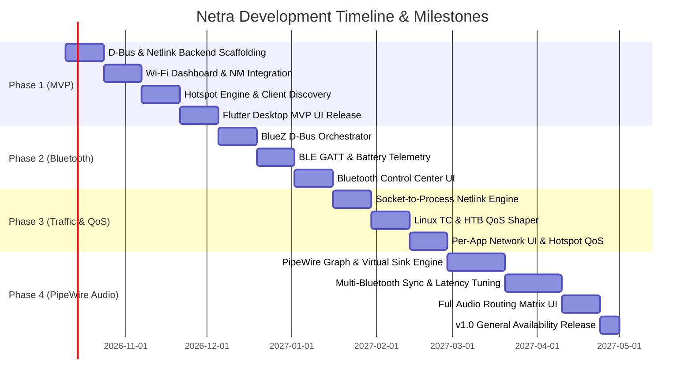

# Netra — Project Planning & Product Requirements Document (PRD)

> **Document Version:** 1.0.0  
> **Target Audience:** Systems Architects, Core Developers, Open-Source Contributors  
> **Status:** Approved Baseline  

---

## 1. Vision & Problem Statement

### 1.1 The Fragmented Linux Experience
Modern Linux desktop environments excel at modularity, but suffer from extreme fragmentation in everyday connectivity and audio management. A user attempting to manage their machine faces several disconnected tools:

| Domain | Legacy Tools | Pain Points |
|---|---|---|
| **Wi-Fi & Networking** | `nmcli`, `nmtui`, GNOME/KDE network applets | Surface-level controls, no real-time packet telemetry, clunky diagnostics. |
| **Hotspot & Tethering** | `nmcli dev wifi hotspot`, ad-hoc scripts | Unreliable 5 GHz AP configuration, zero visibility into connected devices, no per-client bandwidth limits. |
| **Bluetooth** | `blueman`, `bluetoothctl` | Dated UI, unreliable auto-reconnect, no integration with audio sinks or battery management. |
| **Multi-Device Audio** | `pavucontrol`, `helvum`, `qpwgraph` | No native multi-headphone synchronization, complex patchbay nodes confusing non-audio engineers. |
| **Data Usage & QoS** | `nethogs`, `iftop`, `tc`, `nftables` | Completely terminal-bound; difficult to prioritize work traffic or throttle high-bandwidth clients. |

### 1.2 The Netra Solution
**Netra** unifies these disparate subsystems into a single, cohesive desktop command center. It bridges the gap between low-level Linux systems engineering (`NetworkManager`, `BlueZ`, `PipeWire`, `Netlink`, `tc`) and modern, responsive desktop ergonomics (Flutter Desktop + Rust daemon).

---

## 2. Product Objectives & Key Results (OKRs)

### Objective 1: Deliver a Unified, Zero-Terminal Control Center
- **KR 1.1:** 100% of Wi-Fi, Hotspot, Bluetooth, and Audio routing operations achievable via the GUI without opening a terminal.
- **KR 1.2:** Single-click hotspot activation supporting both 2.4 GHz and 5 GHz with automatic conflict resolution.
- **KR 1.3:** Seamless audio routing: redirect any application audio stream to any sink in <= 2 clicks.

### Objective 2: High Performance & Low System Overhead
- **KR 2.1:** Background daemon idle memory footprint < 25 MB RAM; CPU usage < 0.5% at steady-state.
- **KR 2.2:** Telemetry polling updates rendered at a consistent 60 FPS in the Flutter UI without UI thread blocking.
- **KR 2.3:** D-Bus IPC latency under 5ms for standard method invocations.

### Objective 3: Systems-Level Reliability & Audio Synchronization
- **KR 3.1:** Multi-Bluetooth audio playback drift < 15ms between synchronized sinks via PipeWire clock management.
- **KR 3.2:** Sub-second detection of connected hotspot clients and dynamic QoS rule application.
- **KR 3.3:** Zero unhandled crashes in the daemon with automatic systemd recovery.

---

## 3. Detailed Feature Specifications

### Module 1: Network & Wi-Fi Dashboard
- **Access Point Scanning:** Passive and active scans with RSSI signal bars, BSSID, security type, channel, and frequency band.
- **Live Interface Metrics:** Real-time RX/TX throughput graphs (1s, 5s, 60s windows), IP configuration, gateway ping latency, DNS server status.
- **Connection Diagnostics:** Gateway ping, DNS resolution test, internet reachability check, and captive portal detection.
- **Profile Management:** View, edit, prioritize, and delete saved Wi-Fi connection profiles.

### Module 2: Smart Hotspot Manager
- **One-Click Hotspot:** Instant access point creation with customizable SSID, WPA2/WPA3 passphrase, and channel selection (2.4 GHz vs 5 GHz).
- **Connected Client Registry:**
  - Active detection of connected stations using DHCP lease tables and kernel neighbor cache (`rtnetlink`).
  - Device hostname resolution and OUI MAC vendor lookup (e.g., Apple, Samsung, Intel).
  - Connected duration, live download/upload rates, and total session data consumed.
- **Bandwidth Shaping & QoS:**
  - Preset priority profiles per device:
    - **High Priority:** 60% bandwidth guarantee, minimum latency (`fq_codel` / `CAKE`).
    - **Medium Priority:** 30% bandwidth share.
    - **Low Priority:** 10% bandwidth share, throttled buffer.
  - Manual rate capping (e.g., max 5 Mbps download, 1 Mbps upload).
  - One-click kick/block client (via hostapd / iptables / nftables MAC filtering).

### Module 3: Per-App Network Usage
- **Process Bandwidth Monitor:** Task manager style table showing all active network-consuming processes.
- **Metadata Enrichment:** Maps socket inodes to PIDs, resolving process name, executable path, desktop icon, and system user.
- **Historical Data:** Hourly, daily, and monthly bandwidth tracking stored locally in an embedded SQLite database.
- **Actionable Controls:** Terminate network connection, limit process rate, or inspect open socket endpoints (remote IP, port, protocol).

### Module 4: Bluetooth Control Center
- **Device Management:** Discovery, pairing, trusting, connecting, and unpairing for Classic (BR/EDR) and BLE devices.
- **Telemetry & Battery:** Real-time battery status via BlueZ `Battery1` interface and GATT Battery Service (0x180F).
- **Audio Profile Switching:** Seamless switching between A2DP (High-fidelity audio playback) and HFP/HSP (Headset with microphone).
- **Auto-Reconnect Daemon:** Intelligent reconnect policy when paired devices come within radio range.

### Module 5: Advanced PipeWire Audio Routing
- **Multi-Bluetooth Audio (Simultaneous Playback):**
  - Create virtual master sinks in PipeWire (`module-combine-sink` or virtual loopbacks).
  - Stream the same media output (browser, music player, game) to two or more Bluetooth headphones/speakers in sync.
  - Per-sink volume sliders and independent audio latency offset sliders (±100ms) to counteract hardware codec delays.
- **Visual Matrix Audio Routing:**
  - Clear source-to-sink matrix routing.
  - Route individual applications to dedicated physical devices (e.g., Spotify -> Speakers; Discord -> Headset).
- **Smart Device Rules:**
  - Trigger actions on device connect/disconnect (e.g., "When Bose QC45 connects, move Discord voice output to it immediately").

---

## 4. Four-Phase Development Roadmap

### Phase 1: MVP (Minimum Viable Product)
- **Goal:** Robust Network and Hotspot baseline.
- **Deliverables:**
  - Rust system daemon (`netrad`) with D-Bus interface `org.netra.Network` and `org.netra.Hotspot`.
  - NetworkManager integration for scanning, connecting, and disconnecting Wi-Fi.
  - AP mode hotspot creation with DHCP lease tracking.
  - Flutter Desktop application displaying real-time Wi-Fi dashboard, connected hotspot clients, and live interface RX/TX speed.

### Phase 2: Bluetooth Control Center
- **Goal:** Full Bluetooth device orchestration.
- **Deliverables:**
  - BlueZ 5.x D-Bus integration in Rust daemon (`org.netra.Bluetooth`).
  - Device scanning, pairing flow, PIN prompt handling, and trusting.
  - Battery level monitoring and BLE device GATT attributes.
  - Auto-reconnect daemon logic.
  - Flutter UI for unified Bluetooth device management.

### Phase 3: Traffic Analytics & Smart QoS
- **Goal:** Per-application network tracking and hotspot bandwidth shaping.
- **Deliverables:**
  - Netlink `sock_diag` and `/proc` socket-to-process tracker.
  - Traffic Control (`tc` / `htb` / `fq_codel`) rule generator for hotspot interfaces.
  - High/Medium/Low priority QoS tagging and per-device rate limiting.
  - Network task manager UI in Flutter with sorting by instantaneous and cumulative usage.

### Phase 4: Advanced PipeWire Audio Routing
- **Goal:** Multi-device synchronized audio and visual matrix routing.
- **Deliverables:**
  - Native PipeWire graph controller using `pipewire-rs`.
  - Dynamic virtual combine-sink creation with per-endpoint latency compensation.
  - Per-app audio routing policy engine.
  - Modern audio routing matrix UI in Flutter with volume master/slave sliders.
  - v1.0 release packaging (Arch PKGBUILD, Flatpak manifest, Ubuntu deb).

---

## 5. Risk Assessment & Mitigations

| Risk | Impact | Likelihood | Mitigation Strategy |
|---|---|---|---|
| **Wi-Fi Hardware AP Limitations** | High | Medium | Check `iw list` for `AP` mode support and virtual interface capability (`valid interface combinations`) before attempting hotspot setup; display clear diagnostic messages if hardware lacks concurrent station+AP mode. |
| **Bluetooth Audio Latency Drift** | High | High | Leverage PipeWire's built-in clock synchronization and provide manual millisecond-level latency compensation sliders in the UI for users with disparate Bluetooth codecs. |
| **Root Privilege Exploitation** | Critical | Low | Strict privilege separation: the GUI never runs as root; the daemon enforces Polkit policies (`org.netra.policy`) and runs with bounded Linux capabilities (`CAP_NET_ADMIN`). |
| **High CPU Overhead during Netlink Monitoring** | Medium | Medium | Use event-driven Netlink multicast groups (`RTMGRP_LINK`, `RTMGRP_NEIGH`) instead of tight polling loops. Throttle high-frequency UI updates via Rx/Stream debouncing in Rust. |
